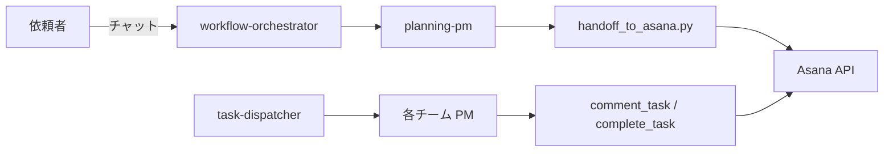
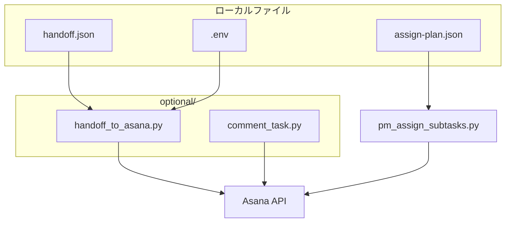

# 要件定義書 — asana-buddy

| 版 | 1.0 |
| 日付 | 2026-06-10 |
| テンプレート | [`requirements-document-format.md`](../requirements-document-format.md) |
| チェックリスト | [`requirements-document-checklist.md`](../requirements-document-checklist.md) |

---

## 1. ツール名

| 項目 | 記入内容 |
|------|----------|
| 正式名称 | asana-buddy |
| 識別子 / slug | `skills/platform/asana-buddy` |
| 略称・呼称 | Asana タスク投入スキル |
| バージョン / 版 | Handoff v1.1 / v1.2 対応 |
| 所有者・問い合わせ先 | platform チーム · workflow-orchestrator 連携 |

---

## 2. システム概要

**目的:** `AsanaBuddyHandoff` JSON を Asana の親 Epic と子タスクに投入し、組織運用 workflow（intake → 企画 → execution dispatch）のタスク管理基盤を担う。

**利用者:** 運用担当者、planning-pm、governance-pm、各チーム PM、workflow-orchestrator（和久桶さん）。

**スコープ:**

- **含む:** タスク作成 · 既存 Epic への sync · サブタスク分解（`pm_assign_subtasks`）· 署名付き comment / complete
- **含まない:** Intake タスクの自動検出 · watch 常駐 · org-os 状態機械（いずれも廃止）

**全体アーキテクチャ:**

**依存関係:** Asana Personal Access Token · Python 3 · リポジトリルート `.venv`

| 用語 | 定義 |
|------|------|
| Handoff | issue-story-planner が出力する Asana 投入用 JSON |
| bootstrap | intake 時の最小 Epic + 企画子 1 件の起票 |
| sync | 既存親への notes 更新と不足子の追加 |

---

## 3. 機能一覧

| 機能 ID | 名称 | 概要 | トリガー | 入力 | 出力 | 関連実装 |
|---------|------|------|----------|------|------|----------|
| F-01 | Handoff 新規投入 | 親+子を作成 | bootstrap / planning gate 後 | `--handoff path.json` | 親 GID · 子 GID | `handoff_to_asana.py` |
| F-02 | 既存 Epic sync | 不足子のみ追加 · notes 更新 | `--parent GID` / `--if-not-exists` | Handoff JSON | sync 結果 JSON | `sync_handoff_to_parent` |
| F-03 | 単発タスク作成 | 親 1 件のみ | 手動 | `--name` `--notes` | task GID | `agent_handler_asana.py` |
| F-04 | PM サブ分解 | assign plan からネスト子 | PM intake 後 | `--plan plan.json` | サブ GID 一覧 | `pm_assign_subtasks.py` |
| F-05 | 署名付きコメント | エージェント作業記録 | 各 worker 完了前 | `--agent` `--body` | story GID | `comment_task.py` |
| F-06 | タスク完了 | completed マーク | comment 後 | `--gid -y` | completed=true | `complete_task.py` |
| F-07 | タスク読取 | notes · 子一覧 | dispatch / PM intake | `--gid` | stdout | `fetch_task.py` |

---

## 4. I/O 一覧

| 種別 | 名称 | プロトコル / 形式 | エンドポイント / パス | 認証・秘密情報 | 主要データ項目 | 障害時の影響 |
|------|------|-------------------|----------------------|----------------|----------------|--------------|
| 入力 | Handoff JSON | ファイル · JSON | `output/planning/handoff/*.json` | なし | `epic` · `subtasks[]` | 投入不可 |
| 入力 | PlanReviewResult | ファイル · JSON | `output/planning/plan-review/*.json` | なし | `status` | gate 不通過 |
| 入力 | assign plan | ファイル · JSON | `skills/*/examples/assign-plan*.json` | なし | `subtasks[]` | PM 分解不可 |
| 入力 | 環境変数 | dotenv | `skills/platform/asana-buddy/optional/.env` | `ASANA_TOKEN` · `ASANA_PROJECT_ID` | project GID | 認証・先頭失敗 |
| 出力 | Asana REST API | HTTPS · JSON | `https://app.asana.com/api/1.0/tasks` | Bearer `ASANA_TOKEN` | `gid` · `permalink_url` | タスク未作成 |
| 出力 | 実施記録 | ファイル · md | `output/governance/records/` · `output/development/` | なし | 変更一覧 | 監査証跡欠落 |
| 双方向 | 仮想環境 | ローカル | `.venv/Scripts/python.exe` | なし | Python 依存 | スクリプト実行不可 |

---

## 5. 操作手順

### OP-01: 初回セットアップ

| 項目 | 内容 |
|------|------|
| 前提条件 | リポジトリ clone 済み · PowerShell 利用可 |
| 手順 | 1. `.\skills\platform\asana-buddy\optional\setup_venv.ps1`  2. `Copy-Item .env.example .env`  3. `ASANA_TOKEN` を設定 |
| 期待結果 | `handoff_to_asana.py --list-projects` がプロジェクト一覧を表示 |
| ロールバック | `.env` 削除後に再設定 |
| 安全注意 | **`.env` を git commit しない** |

### OP-02: bootstrap 投入（intake）

| 項目 | 内容 |
|------|------|
| 前提条件 | bootstrap Handoff JSON 作成済み |
| 手順 | `.\.venv\Scripts\python.exe .\skills\platform\asana-buddy\optional\handoff_to_asana.py --handoff .\output\planning\handoff\bootstrap.<theme>.json -y` |
| 期待結果 | `created_parent <GID>` · 企画子 1 件 `created_subtask` |
| ロールバック | 重複時は `--parent <GID>` で sync（再 create 禁止） |
| 安全注意 | `warn_section_add_failed` 時は recovery_hint に従う |

### OP-03: 本番 Handoff 投入（planning gate 後）

| 項目 | 内容 |
|------|------|
| 前提条件 | `PlanReviewResult` が `passed` または `passed_with_notes` |
| 手順 | `handoff_to_asana.py --handoff <path> --require-review-result <review.json> --parent <親GID> -y --if-not-exists` |
| 期待結果 | `synced_existing` · 不足子のみ `created_subtask` |
| 安全注意 | `--require-review-result` 省略は CI・本番非推奨 |

---

## 6. トラブルシューティング

| 症状 | 想定原因 | 確認手順 | 対処手順 | エスカレーション |
|------|----------|----------|----------|------------------|
| `400 Bad Request` on section add | section GID 無効 | stderr の `warn_section_add_failed` | 親は作成済み。`--parent <GID>` で sync 再実行 | platform · 30 分超 |
| 重複親 Epic | create を二重実行 | 同名親を Asana 検索 | `--if-not-exists` または `--parent` | — |
| `review_ok` 前に失敗 | PlanReviewResult 未添付 / failed | review JSON の `status` | plan-reviewer 再実行 | planning-pm |
| Agent Type CF 400 | サブタスクに CF 非対応 | stderr `Agent Type CF` 警告 | タスク本体は作成済み。CF=skip で継続 | 記録のみ |
| UnicodeEncodeError on dispatch | Windows cp932 | `PYTHONIOENCODING=utf-8` 未設定 | 環境変数設定後に再実行 | — |
| トークンエラー 401 | `ASANA_TOKEN` 無効・期限切れ | `.env` 存在確認 | トークン再発行 · `.env` 更新 | 依頼者（token 保持者） |

---

## 付録

### 変更履歴

| 日付 | 版 | 内容 |
|------|-----|------|
| 2026-06-10 | 1.0 | 初版サンプル（要件定義書フォーマット Epic） |

### 参照リンク

| 種別 | パス |
|------|------|
| スキル SSOT | `skills/platform/asana-buddy/SKILL.md` |
| チャット入口 | `docs/design/chat-driven-ops.md` |
| コメント署名 | `docs/design/agent-asana-comment-signature.md` |
