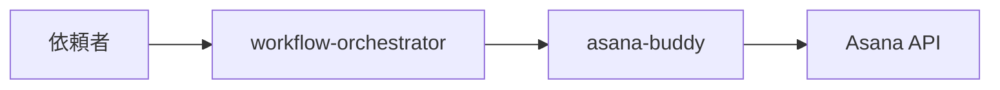

# 要件定義書フォーマット — SSOT

| 版 | 1.1 |
| 日付 | 2026-06-10 |
| 状態 | **本番** |
| SSOT id | `requirements-document-format` |
| 親 Epic | `1215559259242163` |
| 構成案 | [`output/governance/requirements-doc-format-outline.md`](../../output/governance/requirements-doc-format-outline.md)（git 管理外） |

## 目的

ツール・システムを**管理・運用・保守**する担当者へ、必要な情報を標準フォーマットで共有する。新規ツール追加時は本テンプレートをコピーし、各節を記入する。

## 使い方

1. 本ファイルを複製するか、下記「記入テンプレート」節を新規 md に貼り付ける
2. `{…}` プレースホルダを実値で置換する
3. **必須**節がすべて埋まっていることを確認する（[`記入チェックリスト`](#記入チェックリスト) または [`requirements-document-checklist.md`](requirements-document-checklist.md)）
4. 図表は各節の「図表ガイド」および [`requirements-document-checklist.md`](requirements-document-checklist.md) の章別一覧に従い挿入する

---

## 1. ツール名

### 記入テンプレート

| 項目 | 記入欄 |
|------|--------|
| 正式名称 | {正式名称} |
| 識別子 / slug | `{パスまたは slug}` |
| 略称・呼称 | {任意} |
| バージョン / 版 | {任意} |
| 所有者・問い合わせ先 | {チーム / ロール} |

### 記入例

| 項目 | 例 |
|------|-----|
| 正式名称 | asana-buddy |
| 識別子 / slug | `skills/platform/asana-buddy` |
| 略称・呼称 | Asana タスク投入スキル |
| バージョン / 版 | Handoff v1.2 対応 |
| 所有者・問い合わせ先 | platform チーム |

### 図表ガイド

| 種類 | 必須度 | 用途 |
|------|--------|------|
| 表 | **必須** | 上記テンプレート表で十分 |

---

## 2. システム概要

### 記入テンプレート

**目的（1–3 文）**

{なぜこのツールが存在するか}

**利用者**

{誰が読む・使うか}

**スコープ**

- 含む: {…}
- 含まない: {…}

**全体アーキテクチャ（推奨）**

{主要コンポーネントと関係を文章または箇条書き}

**依存関係概要（推奨）**

{外部サービス・前提条件}

**用語集（任意）**

| 用語 | 定義 |
|------|------|
| {用語} | {定義} |

### 記入例

**目的:** Handoff JSON を Asana の親 Epic と子タスクに投入し、組織運用 workflow のタスク管理を担う。

**利用者:** 運用担当、planning-pm、workflow-orchestrator（和久桶さん）。

**スコープ:** 含む — タスク作成・sync・comment/complete。含まない — Intake 自動検出・watch 常駐。

### 図表ガイド

| 種類 | 必須度 | 用途 |
|------|--------|------|
| システム構成図 | **推奨** | コンポーネントとデータの流れ |
| 利用者コンテキスト図 | 任意 | 誰がいつ触るか |

---

## 3. 機能一覧

### 記入テンプレート

| 機能 ID | 名称 | 概要 | トリガー | 入力 | 出力 | 関連実装 |
|---------|------|------|----------|------|------|----------|
| F-01 | {名称} | {1 行} | {入口} | {入力} | {出力} | `{パス}` |

### 記入例

| 機能 ID | 名称 | 概要 | トリガー | 入力 | 出力 | 関連実装 |
|---------|------|------|----------|------|------|----------|
| F-01 | handoff 投入 | 親+子を作成 | planning gate 後 | `--handoff path.json` | Asana GID | `handoff_to_asana.py` |
| F-02 | 既存 Epic sync | 不足子のみ追加 | `--parent GID` | Handoff JSON | sync 結果 | `sync_handoff_to_parent` |

### 図表ガイド

| 種類 | 必須度 | 用途 |
|------|--------|------|
| 機能一覧表 | **必須** | 本章の本体 |
| 機能マップ | 推奨 | カテゴリ別の俯瞰 |

---

## 4. I/O 一覧

### 記入テンプレート

| 種別 | 名称 | プロトコル / 形式 | エンドポイント / パス | 認証・秘密情報 | 主要データ項目 | 障害時の影響 |
|------|------|-------------------|----------------------|----------------|----------------|--------------|
| 入力/出力 | {名称} | {HTTP/ファイル等} | `{パスまたは URL}` | {トークン名のみ・値は書かない} | {フィールド要約} | {不可用時} |

### 記入例

| 種別 | 名称 | プロトコル / 形式 | エンドポイント / パス | 認証 | 主要データ項目 | 障害時の影響 |
|------|------|-------------------|----------------------|------|----------------|--------------|
| 入力 | Handoff JSON | ファイル · JSON | `output/planning/handoff/*.json` | なし | `epic` · `subtasks[]` | 投入不可 |
| 出力 | Asana REST API | HTTPS · JSON | `https://app.asana.com/api/1.0/` | `ASANA_TOKEN` in `.env` | task `gid` | タスク未作成 |
| 入力 | 環境変数 | dotenv | `skills/platform/asana-buddy/optional/.env` | `ASANA_TOKEN` | project GID | 認証失敗 |

### 図表ガイド

| 種類 | 必須度 | 用途 |
|------|--------|------|
| I/O マトリクス表 | **必須** | 接続先一覧 |
| データフロー図 | **推奨** | ファイル / API の流れ |
| ディレクトリツリー | 推奨 | 主要パスの俯瞰 |

---

## 5. 操作手順

### 記入テンプレート

#### OP-{nn}: {手順名称}

| 項目 | 内容 |
|------|------|
| 前提条件 | {…} |
| 手順 | 1. {…}  2. {…} |
| 期待結果 | {…} |
| ロールバック（推奨） | {…} |
| 安全注意 | {…} |

### 記入例

#### OP-01: 初回セットアップ

| 項目 | 内容 |
|------|------|
| 前提条件 | リポジトリ clone 済み |
| 手順 | 1. `setup_venv.ps1`  2. `.env.example` → `.env`  3. `ASANA_TOKEN` 設定 |
| 期待結果 | `handoff_to_asana.py --list-projects` がプロジェクト一覧を表示 |
| ロールバック | `.env` を削除して再設定 |
| 安全注意 | `.env` を git commit しない |

### 図表ガイド

| 種類 | 必須度 | 用途 |
|------|--------|------|
| 操作フロー図 | **推奨** | セットアップ〜実行 |
| チェックリスト | 推奨 | 実施前確認 |

---

## 6. トラブルシューティング

### 記入テンプレート

| 症状 | 想定原因 | 確認手順 | 対処手順 | エスカレーション |
|------|----------|----------|----------|------------------|
| {現象} | {原因} | {切り分け} | {復旧} | {担当・条件} |

### 記入例

| 症状 | 想定原因 | 確認手順 | 対処手順 | エスカレーション |
|------|----------|----------|----------|------------------|
| section add 400 | section GID 無効 | stderr の `warn_section_add_failed` | `--parent <GID>` で sync 再実行 | platform · 30 分超 |
| 重複親 Epic | create を二重実行 | 同名親を Asana で検索 | `--if-not-exists` または `--parent` | — |

### 図表ガイド

| 種類 | 必須度 | 用途 |
|------|--------|------|
| 症状→原因→対処表 | **必須** | 本章の本体 |
| 決定木フロー | 推奨 | 切り分けの分岐 |

---

## 付録

### 変更履歴

| 日付 | 版 | 内容 |
|------|-----|------|
| {YYYY-MM-DD} | {版} | {変更概要} |

### 参照リンク

| 種別 | パス |
|------|------|
| 関連 SSOT | {`docs/design/...`} |
| スキル | {`skills/.../SKILL.md`} |

---

## 記入チェックリスト

| # | 確認項目 | 必須 |
|---|----------|------|
| 1 | 1. ツール名 — 正式名称・識別子が記入されている | ○ |
| 2 | 2. システム概要 — 目的・利用者・スコープが記入されている | ○ |
| 3 | 3. 機能一覧 — 1 行以上の機能表がある | ○ |
| 4 | 4. I/O 一覧 — 接続先・パス・認証方針が記入されている（秘密値なし） | ○ |
| 5 | 5. 操作手順 — 前提・手順・期待結果・安全注意がある | ○ |
| 6 | 6. トラブルシューティング — 症状・対処・エスカレーションがある | ○ |
| 7 | 推奨図表 — システム構成図または I/O フローが 1 つ以上ある | △ |
| 8 | 付録 — 変更履歴または参照リンクがある | △ |

---

## 関連

| 文書 | 内容 |
|------|------|
| [`requirements-document-checklist.md`](requirements-document-checklist.md) | 記入チェックリスト · 図表ガイド全集約 |
| [`examples/requirements-document-asana-buddy.md`](examples/requirements-document-asana-buddy.md) | 記入サンプル（asana-buddy） |
| [`artifact-policy.md`](artifact-policy.md) | 成果物の git 境界 |
| [`chat-driven-ops.md`](chat-driven-ops.md) | 組織運用の標準入口 |

## 変更履歴

| 日付 | 版 | 内容 |
|------|-----|------|
| 2026-06-10 | 1.0 | 初版 SSOT（Epic `1215559259242163`） |
| 2026-06-10 | 1.1 | チェックリスト SSOT リンク · サンプル参照追加 |
