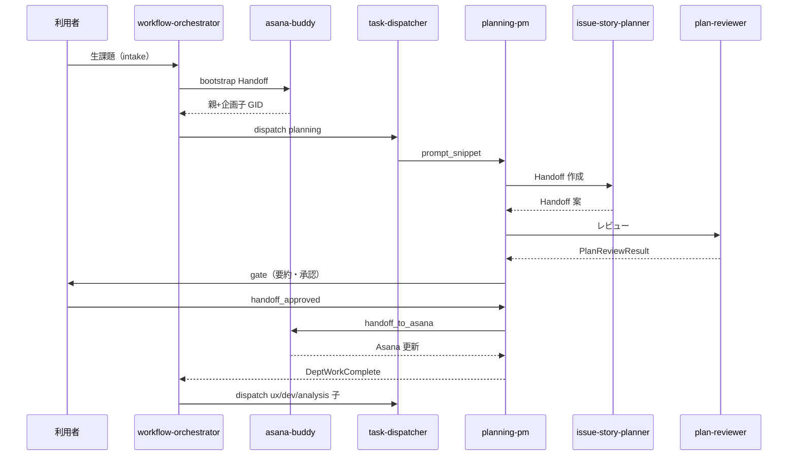

# ワークフロー I/O 契約・ゲート・オーケストレーター責務

registry / workflow 実体は [`workflows/`](../../workflows/)。セッション状態は [`workflow-session-io.md`](workflow-session-io.md)。

**パイプライン図・段階一覧の SSOT は本ファイル。** README / CONTRIBUTING / SKILL / Cursor rule はここを参照し、同じ ASCII 図をコピーしない。

**本番入口 SSOT:** [`chat-driven-ops.md`](chat-driven-ops.md) — 和久桶さんへのチャット依頼。**intake 三モード:** [`wakuoke-intake-modes.md`](wakuoke-intake-modes.md)。**Asana 自動化**（タスク自動検出・無人起動）と org-os は廃止。**Asana タスク運用**（作成・遂行）は基本。

## 標準パイプライン（default v6 · SSOT）

```
依頼者 ──チャット──► workflow-orchestrator（intake → bootstrap → dispatch）
  → asana-buddy（bootstrap: Asana 親 + 企画子）
  → planning-pm（企画チーム / planning-delivery）
    → issue-story-planner → plan-reviewer（必須）
    → planning-pm（gate）→ asana-buddy（Handoff 投入）
  → task-dispatcher（execution 系子ごと · **L2 デフォルト自動進行**）
  → 各 PM: pm_assign_subtasks → **pm_review_gate（opt-in · 人間）** → L3b worker dispatch
  → ux-pm → ux-designer / ux-reviewer
  → product-manager → requirements-writer / …
  → governance-pm → ssot-implementer / governance-reviewer
  → audit-pm → consistency-auditor / audit-reviewer（組織変更エピックの **最後**）
```

- L1 定義: [`workflows/default.yaml`](../../workflows/default.yaml) v6（チャット入口 · suspend/resume 廃止）
- 廃止: [`org-os-product-io.md`](org-os-product-io.md) · [`asana-driven-ops.md`](asana-driven-ops.md)
- 企画 L3: [`workflows/planning-delivery.yaml`](../../workflows/planning-delivery.yaml)
- 組織ルーティング: [`workflows/organizations.yaml`](../../workflows/organizations.yaml)
- 手順（コマンド例）: [`docs/e2e/default-workflow.md`](../e2e/default-workflow.md)

## 段階とスロット（default v4）

| 段階 ID | スロット | 担当スキル | 入力 | 出力 |
|---------|----------|------------|------|------|
| `intake` | orchestrate | workflow-orchestrator | チャット自然言語（本番） | bootstrap Handoff |
| `triage` | orchestrate | workflow-orchestrator | 任意 — intake-asana 時 snapshot | `epic_input` JSON |
| `bootstrap` | execute | asana-buddy | bootstrap Handoff | Asana 親 + 企画子 1 件 |
| `dispatch` | dispatch | task-dispatcher | DispatchRequest（planning） | planning-pm 用 prompt_snippet |

## 企画チーム L3（planning-delivery）

| 段階 ID | スロット | 担当 | 入力 | 出力 |
|---------|----------|------|------|------|
| `handoff_plan` | dept_work | issue-story-planner | 生課題 + 子 notes | `AsanaBuddyHandoff` |
| `plan_review` | dept_review | plan-reviewer | Handoff 案 | `PlanReviewResult` |
| `pm_gate` | dept_orchestrate | planning-pm | Handoff + PlanReviewResult | execute 可否 |
| `asana_execute` | execute | asana-buddy | 承認済み Handoff | Asana 親更新 + 実行系子 |

## ゲート（企画チーム内）

| ゲート ID | 条件 | 未達時 |
|-----------|------|--------|
| `review_passed` | **`plan-reviewer` 必須。** `PlanReviewResult.status` が `passed` または `passed_with_notes` | `asana_execute` 不可。差し戻しは `handoff_plan` |
| `handoff_approved` | `review_passed` 済み。**デフォルト（opt-out）:** 要約提示後 **同一セッションで `handoff_to_asana`**。**opt-in:** `human_planning_approval` · `create_planning_approval_gate` — チャット確認（[`planning-gate-vs-pm-review-gate.md`](planning-gate-vs-pm-review-gate.md)） | `handoff_to_asana` 不可 |

## asana_execute 後（execution 系 — 必須分離）

`handoff_to_asana.py`（`--require-review-result`）で execution 系子が Asana に存在した**後**:

| 禁止 | 正規 |
|------|------|
| 同一セッションで development / ux / analysis の **成果物・doc 更新**に着手 | [`task-dispatcher`](../../skills/platform/task-dispatcher/SKILL.md) → 各 PM **intake**（**L2 デフォルト: チャット確認なし** — [`dispatch-auto-proceed-ssot.md`](dispatch-auto-proceed-ssot.md)） |
| product-manager / ux-pm / analytics-pm が **ワーカー役を代行** | `pm_assign_subtasks` → **pm_review_gate（opt-in）** → **L3b** worker dispatch（[`dispatch-prompt-ssot.md`](dispatch-prompt-ssot.md)） |
| gate 承認を「実装開始の合図」とみなす | 企画 PM は **comment → complete → DeptWorkComplete** まで。実行系は別 dispatch |

org-ops メタ doc のみの開発子は **profile: doc-only**（[`assign-plan.org-meta-doc-v1.json`](../../skills/development/examples/assign-plan.org-meta-doc-v1.json)）。本体を PM が先行完了した場合の事後補完: [`docs/verification/platform/asana-comment-detail-delivery.md`](../verification/platform/asana-comment-detail-delivery.md)。

**PM review gate（execution）:** [`pm-assign-review-gate.md`](pm-assign-review-gate.md) · planning gate との違い: [`planning-gate-vs-pm-review-gate.md`](planning-gate-vs-pm-review-gate.md) · **L2 dispatch 自動進行:** [`dispatch-auto-proceed-ssot.md`](dispatch-auto-proceed-ssot.md)（opt-in: `human_execution_dispatch` / `ORG_OPS_EXECUTION_DISPATCH_CONFIRM=1`）

**チャットドリブン運用（本番）:** [`chat-driven-ops.md`](chat-driven-ops.md) — 和久桶さんチャット入口 · 同一セッション進行。**廃止:** [`asana-driven-ops.md`](asana-driven-ops.md) · org-os

**タスク / エピックレトロ（親 complete 前）:** [`task-retrospective-ssot.md`](task-retrospective-ssot.md) — 各 complete 前レトロ · audit 後集約 · 依頼者承認 → intake 起票

**配賦順（execution 系）:** ux → development / analysis → **`audit`（組織変更時・親 complete 直前）**。監査は他 execution 子完了後に dispatch する（[`audit-delivery-io.md`](audit-delivery-io.md)）。

## エージェント進行（L1）

- **intake 担当**は bootstrap → dispatch（企画チーム）まで同一セッションで進める。
- **和久桶さん（workflow-orchestrator）への相談**も intake から。メタ変更（新 department · registry 等）を **gate 前に直接実装しない**（[`workflow-orchestrator/SKILL.md`](../../skills/platform/workflow-orchestrator/SKILL.md)）。
- **企画 gate** は planning-pm が担当（L1 orchestrator から移管）。

## orchestrator の役割（v3）

| step | 役割 |
|------|------|
| `intake` | 課題受付 · snapshot 取得 |
| `triage` | snapshot → epic_input 正規化 |
| `bootstrap` | asana-buddy — Asana 親 + 企画子 1 件 |
| `dispatch` | 企画チームへ初回配賦；完了後は execution 系子を順次配賦 |

## 変更境界（新規スキル追加時）

| 変更するもの | 誰が | 内容 |
|--------------|------|------|
| `skills/<organization>/<slug>/` 実体 | **agent-creater のみ** | README, SKILL, personas, optional |
| `workflows/agent-registry.yaml` | 人間（PR） | slug, slot, I/O 参照, enabled |
| `workflows/*.yaml` | 人間（PR） | 段階・agent 参照・ゲート |
| 個別 SKILL.md | agent-creater 生成後に調整 | スロット固有ロジック |

## シーケンス（default v3）



## 移行（v2 → v3）

v2 では L1 に plan / review / gate / execute があった。**v3 から企画は planning-delivery（L3）** で実行する。

## 新規 SKILL 実体

**agent-creater 経由のみ**（[`skills-inventory.md`](../inventory/skills-inventory.md) 参照）。
