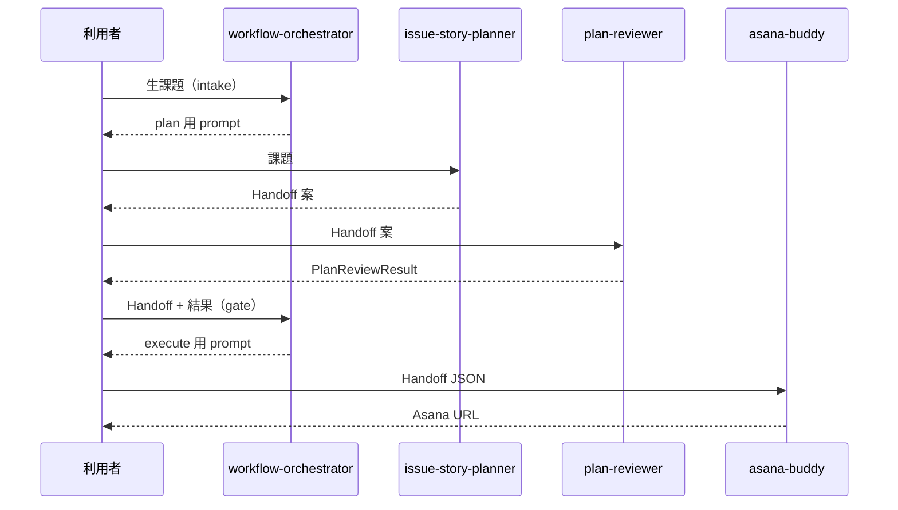

# ワークフロー I/O 契約・ゲート・オーケストレーター責務

registry / workflow 実体は [`workflows/`](../../workflows/)。セッション状態は [`workflow-session-io.md`](workflow-session-io.md)。

## 段階とスロット（default v2）

| 段階 ID | スロット | 担当スキル | 入力 | 出力 |
|---------|----------|------------|------|------|
| `intake` | orchestrate | workflow-orchestrator | 生課題（自然言語） | plan 委譲 `prompt_snippet` |
| `plan` | plan | issue-story-planner | 課題（orchestrator 経由） | `AsanaBuddyHandoff` v1.1 |
| `review` | review | plan-reviewer | Handoff v1.1 案 | `PlanReviewResult` + 改訂 Handoff（任意） |
| `gate` | orchestrate | workflow-orchestrator | 改訂 Handoff + PlanReviewResult | execute 可否・`prompt_snippet` |
| `execute` | execute | asana-buddy | 承認済み Handoff v1.1 | Asana 親＋子タスク |

## ゲート

| ゲート ID | 条件 | 未達時 |
|-----------|------|--------|
| `review_passed` | **`plan-reviewer` 必須。** `PlanReviewResult.status` が `passed` または `passed_with_notes` | `gate` / `execute` 不可。差し戻しは `plan` |
| `handoff_approved` | `review_passed` 済みのうえ、人間が orchestrator（gate）経由で execute 可と明示 | `execute` を案内しない |

## orchestrator の二役

| step | 役割 |
|------|------|
| `intake` | 課題受付。利用者の**唯一の入口**（新規依頼の開始点） |
| `gate` | review 後の execute 判定 |

## 変更境界（新規スキル追加時）

| 変更するもの | 誰が | 内容 |
|--------------|------|------|
| `skills/<slug>/` 実体 | **agent-creater のみ** | README, SKILL, personas, optional |
| `workflows/agent-registry.yaml` | 人間（PR） | slug, slot, I/O 参照, enabled |
| `workflows/*.yaml` | 人間（PR） | 段階・agent 参照・ゲート |
| 個別 SKILL.md | agent-creater 生成後に調整 | スロット固有ロジック |

**禁止:** workflow-orchestrator / issue-story-planner / plan-reviewer が他スキルの雛形を新規作成すること。

## シーケンス（デフォルト v2）

## 移行（v1 → v2）

以前は `plan` 先頭（planner を最初に起動）。**新規依頼は `workflow-orchestrator`（intake）から**開始する（[`README.md`](../../README.md)）。

## 新規 SKILL 実体

**agent-creater 経由のみ**（[`skills-inventory.md`](../inventory/skills-inventory.md) 参照）。
