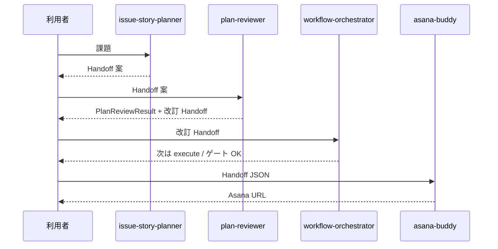

# ワークフロー I/O 契約・ゲート・オーケストレーター責務

タスク 2 成果物。registry / workflow 実体は [`workflows/`](../../workflows/)。

## 段階とスロット

| 段階 ID | スロット | 担当スキル | 入力 | 出力 |
|---------|----------|------------|------|------|
| `plan` | plan | issue-story-planner | 課題・テーマ（自然言語） | `AsanaBuddyHandoff` v1.1 |
| `review` | review | plan-reviewer | Handoff v1.1 案 | `PlanReviewResult` + 改訂 Handoff（任意） |
| `orchestrate` | orchestrate | workflow-orchestrator | 改訂 Handoff、現段階 | 次に呼ぶスキル・ゲート状態 |
| `execute` | execute | asana-buddy | 承認済み Handoff v1.1 | Asana 親＋子タスク |

## ゲート

| ゲート ID | 条件 | 未達時 |
|-----------|------|--------|
| `review_passed` | **`plan-reviewer` 必須。** `PlanReviewResult.status` が `passed` または `passed_with_notes` | 未達時は Asana 投入不可。差し戻しは `plan` へ。人間目視のみは不可 |
| `handoff_approved` | `review_passed` 済みのうえ、人間が orchestrator 経由で execute 可と明示 | `execute` を案内しない |

## 変更境界（新規スキル追加時）

| 変更するもの | 誰が | 内容 |
|--------------|------|------|
| `skills/<slug>/` 実体 | **agent-creater のみ** | README, SKILL, personas, optional |
| `workflows/agent-registry.yaml` | 人間（PR） | slug, slot, I/O 参照, enabled |
| `workflows/*.yaml` | 人間（PR） | 段階・agent 参照・ゲート |
| 個別 SKILL.md | agent-creater 生成後に調整 | スロット固有ロジック |

**禁止:** workflow-orchestrator / issue-story-planner / plan-reviewer が他スキルの雛形を新規作成すること。

## シーケンス（デフォルト）

## 新規 SKILL 実体

**agent-creater 経由のみ**（[`skills-inventory.md`](../inventory/skills-inventory.md) 参照）。
