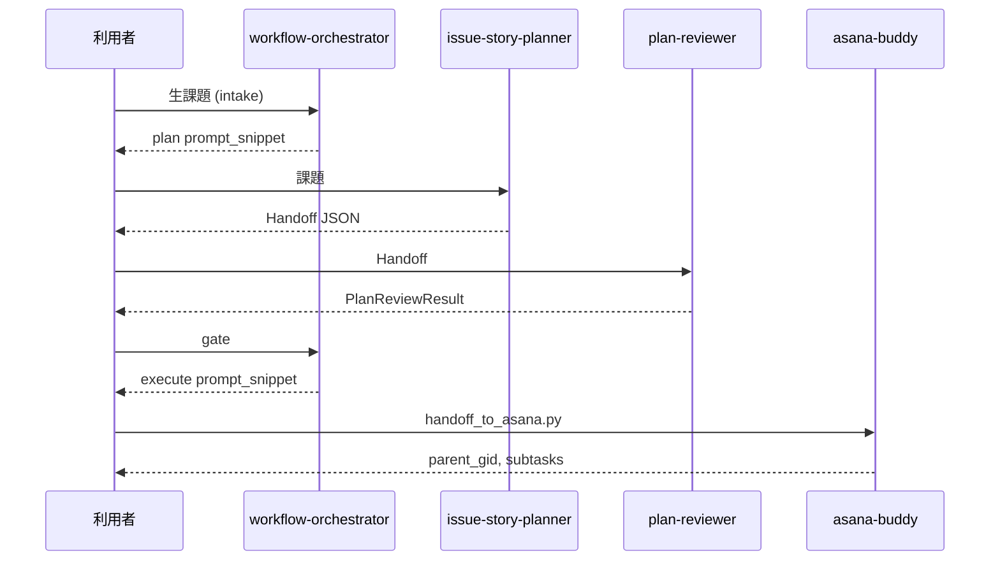
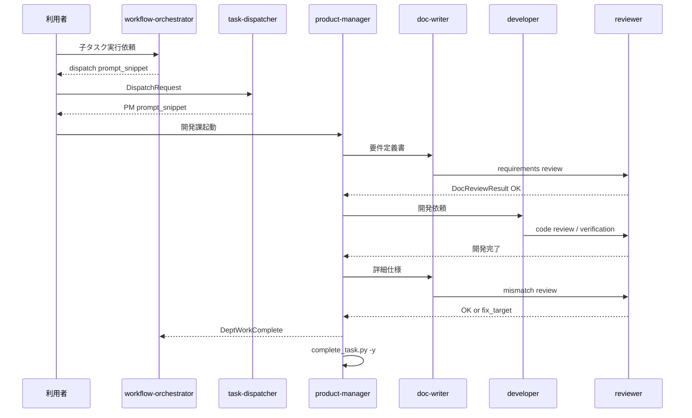

# 詳細仕様書 — エージェント構成とワークフロー

| 項目 | 内容 |
|------|------|
| 文書種別 | 詳細仕様書（detailed-spec） |
| 作成者ロール | product-manager |
| 対応要件定義 | [`output/development/requirements/agent-composition-requirements.md`](../requirements/agent-composition-requirements.md) |
| 版 | 1.1 |
| 日付 | 2026-05-23 |

---

## 1. システム構成概要

### 1.1 アーキテクチャ（3 層）

```
[利用者]
    │
    ▼
┌──────────────────────────────────────────────────┐
│ L1  workflows/default.yaml (v2)                  │
│     intake → plan → review → gate → execute      │
│     agents: orchestrator, planner, reviewer,     │
│             asana-buddy                          │
└──────────────────────────────────────────────────┘
    │ Asana 親 + 子タスク
    ▼
┌──────────────────────────────────────────────────┐
│ L2  workflows/with-dispatch.yaml               │
│     dispatch (per child task)                  │
│     agents: orchestrator → task-dispatcher       │
│     config: workflows/organizations.yaml         │
└──────────────────────────────────────────────────┘
    │ DispatchRequest
    ▼
┌──────────────────────────────────────────────────┐
│ L3  workflows/development-delivery.yaml         │
│     (scope: single_subtask)                      │
│     agents: product-manager (hub)                │
│             doc-writer, developer, reviewer      │
│  — または —                                      │
│ L3  workflows/analysis-delivery.yaml             │
│     agents: analytics-pm (hub)                   │
│             data-* / ml-engineer / analysis-reviewer │
└──────────────────────────────────────────────────┘
    │ DeptWorkComplete
    ▼
[workflow-orchestrator — エピック完了集約]
```

### 1.2 workflow ファイル一覧

| ファイル | id | 終端 step | 用途 |
|----------|-----|-----------|------|
| `workflows/default.yaml` | default | execute | 企画〜Asana 化（標準） |
| `workflows/with-dispatch.yaml` | with-dispatch | dispatch | 企画 + 子タスク配賦 |
| `workflows/with-execution.yaml` | with-execution | work | **過渡期** — 単一 task-executor |
| `workflows/development-delivery.yaml` | development-delivery | pm_complete | 開発課・子 1 件 |
| `workflows/analysis-delivery.yaml` | analysis-delivery | pm_complete | 分析課・子 1 件 |
| `workflows/organizations.yaml` | — | — | department → workflow ルーティング |
| `workflows/agent-registry.yaml` | — | — | slug・slot・I/O 登録 |

**解釈方式:** 全 YAML は**宣言的ドキュメント**。ランタイムエンジンはなく、エージェント（人間 + LLM）が SKILL / YAML を読んで順守する。

---

## 2. エージェント仕様（registry 準拠）

登録元: [`workflows/agent-registry.yaml`](../../workflows/agent-registry.yaml)

### 2.1 L1 — 企画

#### workflow-orchestrator

| 項目 | 値 |
|------|-----|
| slot | orchestrate |
| workflow_steps | intake, gate |
| 入力（intake） | `raw_request`（自然言語） |
| 入力（gate） | AsanaBuddyHandoff + PlanReviewResult |
| 出力 | `prompt_snippet`, `current_step_id`, `gate_status` |
| 参照 | default.yaml, with-dispatch.yaml, organizations.yaml, agent-registry.yaml |

**intake 出力例（plan 向け）:**

```
あなたは issue-story-planner スキルです。テーマ「〈課題〉」について…
AsanaBuddyHandoff v1.1（各 subtask に background・summary・done_when 必須）の JSON を1つだけ出力してください。
```

**gate 後（execute 向け）:** `handoff_to_asana.py` コマンド例を含む snippet。

**execute 後（dispatch 向け）:** 未完了子の GID + `DispatchRequest` 例。

#### issue-story-planner

| 項目 | 値 |
|------|-----|
| slot | plan |
| 出力 | AsanaBuddyHandoff |
| schema | v1.1: `schemas/asana-buddy-handoff.v1.schema.json` |
| | v1.2: `schemas/asana-buddy-handoff.v1.2.schema.json`（+ `subtasks[].department`） |
| 子タスク順 | JSON 配列 = 着手順（先頭が最初）。API は**逆順**で create |

#### plan-reviewer

| 項目 | 値 |
|------|-----|
| slot | review |
| 入力 | AsanaBuddyHandoff |
| 出力 | PlanReviewResult v1.0 |
| 通過 status | `passed`, `passed_with_notes` |

#### asana-buddy

| 項目 | 値 |
|------|-----|
| slot | execute |
| スクリプト | `handoff_to_asana.py`, `fetch_task.py`, `complete_task.py` |
| Handoff 受理 | schema_version `1.1` または `1.2`（`load_handoff`） |
| 子 notes 組立 | `課:` → `柱:` → 背景 / 概要 / 完了条件（`assemble_subtask_notes`） |

### 2.2 L2 — 配賦

#### task-dispatcher

| 項目 | 値 |
|------|-----|
| slot | dispatch |
| 入力 | DispatchRequest v1.0 |
| 出力 | `workflow_id`, `entry_agent`, entry 用 `prompt_snippet` |
| ルーティング | organizations.yaml `departments[]` |

**organizations.yaml — development（有効）**

```yaml
id: development
workflow_id: development-delivery
entry_agent: product-manager
enabled: true
```

**organizations.yaml — analysis（有効）**

```yaml
id: analysis
workflow_id: analysis-delivery
entry_agent: analytics-pm
enabled: true
```

### 2.3 L3 — 開発課

#### product-manager

| 項目 | 値 |
|------|-----|
| entry | development-delivery の `policy.entry_agent` |
| 入力 | 子 task_gid、親文脈（任意）、DispatchRequest 経由 |
| 出力 | DeptWorkComplete v1.0 |
| 完了操作 | `complete_task.py --gid <child> -y`（done_when 達成時） |

#### doc-writer / developer / reviewer

| slug | 主成果物 | reviewer review_kind |
|------|----------|----------------------|
| doc-writer | requirements-doc, detailed-spec | requirements, detailed_spec, mismatch（間接） |
| developer | code（リポジトリ変更） | code → verification |
| reviewer | 各 ReviewResult JSON | requirements, code, verification, mismatch |

### 2.4 L3 — 分析課

#### analytics-pm

| 項目 | 値 |
|------|-----|
| entry | analysis-delivery の `policy.entry_agent` |
| 入力 | 子 task_gid、親文脈（任意）、DispatchRequest 経由 |
| 出力 | DeptWorkComplete v1.0（`department: analysis`） |
| 完了操作 | `comment_task.py` → `complete_task.py --gid <child> -y` |

#### 委譲ロール

| slug | 主フェーズ | analysis-reviewer review_kind |
|------|------------|-------------------------------|
| analytics-pm | 要求定義・価値検証 | analytics_requirements（要件レビュー時） |
| data-architect | データ設計・SLA | data_model |
| data-engineer | ETL/ELT | pipeline |
| data-steward | 品質・ガバナンス | data_quality |
| data-analyst | 探索・ダッシュボード | analysis_insights |
| data-scientist | モデル開発 | model_eval |
| ml-engineer | デプロイ・運用（**production_gate 通過後**） | deploy_verification |
| analysis-reviewer | 各ゲート | production_deploy_gate（DeployGateResult） |

詳細: [`docs/design/analysis-delivery-io.md`](../design/analysis-delivery-io.md)

### 2.5 メタ・レガシー

| slug | 備考 |
|------|------|
| agent-creater | workflow 非載載。`skills/<organization>/<slug>/` 雛形のみ |
| task-executor | `deprecated: true`, `enabled: true`。TaskWorkRequest → TaskWorkResult |

---

## 3. 課内ワークフロー詳細

### 3.1 開発課（development-delivery）

| order | step id | agent | gate_after | artifact |
|-------|---------|-------|------------|----------|
| 1 | pm_intake | product-manager | — | — |
| 2 | requirements_doc | doc-writer | — | requirements-doc |
| 3 | requirements_review | reviewer | requirements_review_passed | DocReviewResult |
| 4 | pm_handoff_dev | product-manager | — | — |
| 5 | development | developer | — | code |
| 6 | code_review | reviewer | code_review_passed | CodeReviewResult |
| 7 | verification | reviewer | verification_passed | VerificationResult |
| 8 | pm_request_spec | product-manager | — | — |
| 9 | detailed_spec | doc-writer | — | detailed-spec |
| 10 | mismatch_review | reviewer | mismatch_resolved | MismatchReviewResult |
| 11 | pm_complete | product-manager | — | DeptWorkComplete |

### 3.2 開発課 — 分岐（mismatch）


### 3.3 開発課 — 成果物パス規約（推奨）

| artifact | パス例 |
|----------|--------|
| requirements-doc | `output/development/requirements/<scope>-requirements.md` |
| detailed-spec | `output/development/specs/<scope>-spec.md` |
| 本ドキュメント | `agent-composition-*`（リポジトリ全体の構成説明） |

### 3.4 分析課（analysis-delivery）

[`workflows/analysis-delivery.yaml`](../../workflows/analysis-delivery.yaml) — entry: **analytics-pm**。要求定義 → データ設計 → ETL → 品質 → 探索 → モデル → **本番ゲート** → デプロイ → 価値検証。

| order | step id | agent | gate_after |
|-------|---------|-------|------------|
| 1 | pm_intake | analytics-pm | — |
| 2 | requirements | analytics-pm | — |
| 3 | requirements_review | analysis-reviewer | requirements_review_passed |
| … | data_design … model_review | 各ロール | 各ゲート |
| — | production_gate | analysis-reviewer | production_gate_passed |
| — | deploy_ops | ml-engineer | — |
| — | pm_complete | analytics-pm | DeptWorkComplete |

必須運用（SLA 明文化・本番デプロイ前承認・RBAC）: [`analysis-delivery-io.md`](../design/analysis-delivery-io.md)

Handoff 例: [`handoff.analysis-delivery.json`](../../skills/planning/issue-story-planner/examples/handoff.analysis-delivery.json)

---

## 4. データ契約

### 4.1 企画系

| 型 | schema_version | 主なフィールド |
|----|----------------|----------------|
| AsanaBuddyHandoff | 1.1 / 1.2 | epic, subtasks[] |
| PlanReviewResult | 1.0 | status, summary, findings[] |

### 4.2 配賦・課内系

| 型 | ファイル |
|----|----------|
| DispatchRequest | `skills/platform/task-dispatcher/schemas/dispatch-request.v1.schema.json` |
| DeptWorkComplete | `skills/development/product-manager/schemas/dept-work-complete.v1.schema.json` |
| DocReviewResult | `skills/development/reviewer/schemas/doc-review-result.v1.schema.json` |
| CodeReviewResult | `skills/development/reviewer/schemas/code-review-result.v1.schema.json` |
| VerificationResult | `skills/development/reviewer/schemas/verification-result.v1.schema.json` |
| MismatchReviewResult | `skills/development/reviewer/schemas/mismatch-review-result.v1.schema.json` |
| AnalysisDocReviewResult | `skills/analysis/analysis-reviewer/schemas/analysis-doc-review-result.v1.schema.json` |
| DeployGateResult | `skills/analysis/analysis-reviewer/schemas/deploy-gate-result.v1.schema.json` |

### 4.3 Asana notes 形式（子タスク）

```markdown
課: development

柱: 実装・開発課

## 背景
…

## 概要
…

## 完了条件
…
```

`fetch_task.py` は notes を**そのまま表示**する。`課:` の自動パース API は**未実装**（dispatcher SKILL は LLM による読取を前提）。

### 4.4 department 解決順（推奨運用）

1. DispatchRequest の `department`（明示）
2. Handoff v1.2 の `subtasks[].department`
3. Asana notes の `課:` 行
4. `organizations.yaml` の `pillar_defaults`（**文書上のヒューリスティックのみ**、コード未実装）

---

## 5. エンドツーエンドシーケンス

### 5.1 企画〜Asana



### 5.2 配賦〜開発課完了（子 1 件）



### 5.3 エピック完了

orchestrator が `fetch_task.py --list-subtasks` で全子 `completed` を確認後、利用者へ報告。

---

## 6. CLI 仕様（asana-buddy）

| コマンド | 用途 |
|----------|------|
| `handoff_to_asana.py --handoff PATH [--require-review-result PATH] -y` | 親+子作成 |
| `fetch_task.py --gid GID [--list-subtasks]` | 読取 |
| `complete_task.py --gid GID -y` | 完了マーク |

環境: `skills/platform/asana-buddy/optional/.env`（`ASANA_TOKEN`, `ASANA_PROJECT_ID`）。

---

## 7. 拡張手順（新規エージェント）

1. **agent-creater** で `skills/<organization>/<slug>/` 生成（README, SKILL, personas）
2. `workflows/agent-registry.yaml` に登録
3. 必要なら `workflows/*.yaml` に step 追加
4. `organizations.yaml` に department 行追加（配賦対象の場合）
5. `docs/design/workflow-io-contract.md` / session I/O を更新（PR）

**禁止:** orchestrator / planner / reviewer が他スキルを手書き新規作成。

---

## 8. 既知の制約・ギャップ（現状実装）

要件定義との差分・改善候補。レビュー指摘と整合。

| # | 項目 | 影響 |
|---|------|------|
| G1 | workflow **自動実行エンジンなし** | ステップ飛ばしは運用で防止 |
| G2 | `pillar_defaults` **コード未実装** | department 推定が不安定 |
| G3 | `with-dispatch` は dispatch で終端 | development-delivery は**別 YAML**、PM 起動は手動/プロンプト連鎖 |
| G4 | `workflow-session-io.md` が dispatch 未反映 | セッション `current_step_id` に `dispatch` なし |
| G5 | `asana-buddy` SKILL が v1.1 表記のまま | `課:` 行の公式説明が SKILL に未統合 |
| G6 | registry の planner / asana-buddy が schema **1.1 固定表記** | v1.2 は実際には load_handoff 受理 |
| G7 | `task-executor` が deprecated かつ **enabled: true** | 誤ルートの余地 |
| G8 | 組織配賦・分析課スキルは **手動雛形** | CONTRIBUTING の agent-creater 唯一入口と注記ずれ |
| G9 | 課内 ReviewResult の **CLI 検証なし** | JSON Schema は参照用 |

---

## 9. 要件定義とのトレーサビリティ

| 要件 ID | 仕様での充足 | 備考 |
|---------|--------------|------|
| FR-L1-01〜09 | §2.1, §5.1, §4.1 | v1.2 は load_handoff 対応 |
| FR-L2-01〜07 | §2.2, §4.4, §5.2 | G2, G3 が推奨要件の弱点 |
| FR-L3-01〜08 | §3.1, §5.2 | 開発課・プロンプト順守前提 |
| FR-L3-A01〜A08 | §2.4, §3.4 | 分析課（analysis-delivery） |
| FR-X-01〜05 | §2.5, §7, §8 G8 | |
| NFR-01〜05 | §1.2, §8 G1 | |

---

## 10. 改訂履歴

| 版 | 日付 | 変更 |
|----|------|------|
| 1.0 | 2026-05-18 | 初版（現状構成の PM 起票） |
| 1.1 | 2026-05-23 | 分析課 delivery 実装（analytics-pm ハブ + 7 ロール）を反映 |
