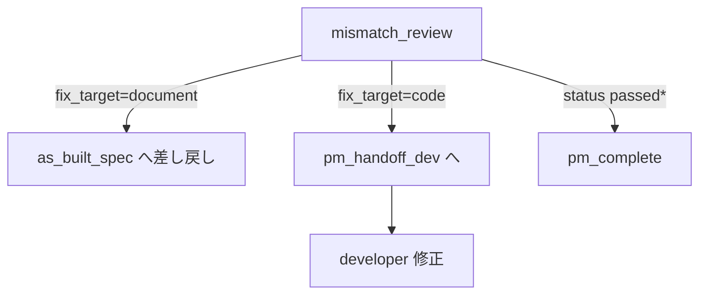
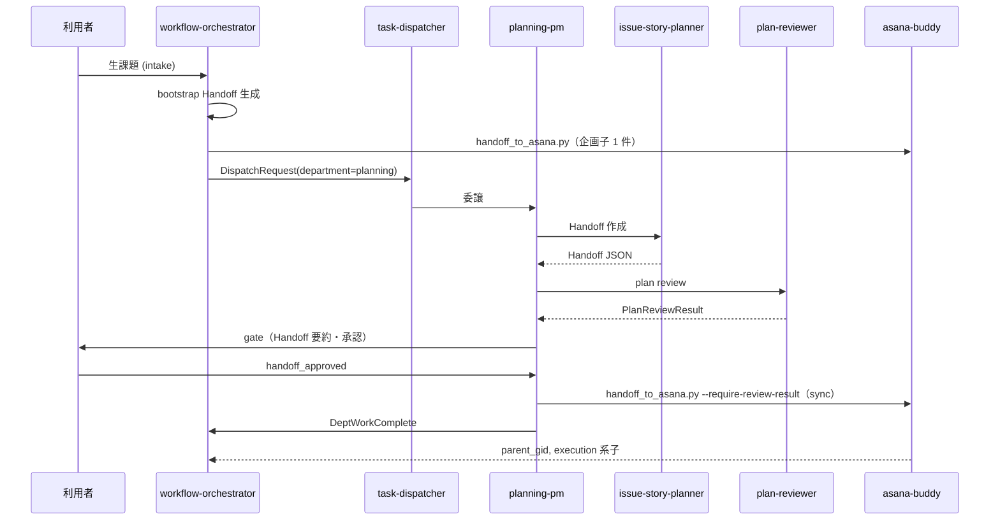
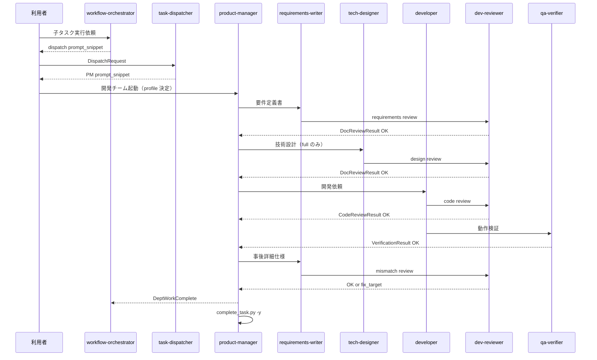

# 詳細仕様書 — エージェント構成とワークフロー

| 項目 | 内容 |
|------|------|
| 文書種別 | 詳細仕様書（detailed-spec） |
| 作成者ロール | product-manager |
| 対応要件定義 | [`output/development/requirements/agent-composition-requirements.md`](../requirements/agent-composition-requirements.md) |
| 版 | 1.3 |
| 日付 | 2026-05-23 |

---

## 1. システム構成概要

### 1.1 アーキテクチャ（3 層）

```
[利用者]
    │
    ▼
┌──────────────────────────────────────────────────┐
│ L1  workflows/default.yaml (v3)                  │
│     intake → bootstrap → dispatch（企画）          │
│     agents: orchestrator, asana-buddy, dispatcher│
└──────────────────────────────────────────────────┘
    │ Asana 親 + 企画子
    ▼
┌──────────────────────────────────────────────────┐
│ L3  workflows/planning-delivery.yaml             │
│     Handoff → review → gate → Asana タスク化     │
│     agents: planning-pm, planner, reviewer,      │
│             asana-buddy                          │
└──────────────────────────────────────────────────┘
    │ Asana 親 + execution 系子
    ▼
┌──────────────────────────────────────────────────┐
│ L2  workflows/with-dispatch.yaml               │
│     dispatch (per child task)                  │
│     agents: orchestrator → task-dispatcher       │
│     config: workflows/organizations.yaml         │
└──────────────────────────────────────────────────┘
    │ DispatchRequest
    ▼
┌──────────────────────────────────────────────────┐
│ L3  workflows/development-delivery.yaml (v2)    │
│     agents: product-manager (hub)                │
│             requirements-writer, tech-designer,  │
│             developer, dev-reviewer, qa-verifier │
│  — または —                                      │
│ L3  workflows/analysis-delivery.yaml             │
│     agents: analytics-pm (hub)                   │
│             data-* / ml-engineer / analysis-reviewer │
└──────────────────────────────────────────────────┘
    │ DeptWorkComplete
    ▼
[workflow-orchestrator — エピック完了集約]
```

### 1.2 workflow ファイル一覧

| ファイル | id | 終端 step | 用途 |
|----------|-----|-----------|------|
| `workflows/default.yaml` | default | dispatch | 受付〜企画 dispatch（標準） |
| `workflows/planning-delivery.yaml` | planning-delivery | pm_complete | 企画チーム・子 1 件 |
| `workflows/with-dispatch.yaml` | with-dispatch | dispatch | 受付 + execution 系 dispatch |
| `workflows/with-execution.yaml` | with-execution | work | **過渡期** — 単一 task-executor |
| `workflows/development-delivery.yaml` | development-delivery | pm_complete | 開発チーム・子 1 件（v2） |
| `workflows/analysis-delivery.yaml` | analysis-delivery | pm_complete | 分析チーム・子 1 件 |
| `workflows/organizations.yaml` | — | — | department → workflow ルーティング |
| `workflows/agent-registry.yaml` | — | — | slug・slot・I/O 登録 |

**解釈方式:** 全 YAML は**宣言的ドキュメント**。ランタイムエンジンはなく、エージェント（人間 + LLM）が SKILL / YAML を読んで順守する。

---

## 2. エージェント仕様（registry 準拠）

登録元: [`workflows/agent-registry.yaml`](../../workflows/agent-registry.yaml)

### 2.1 L1 — 受付

#### workflow-orchestrator

| 項目 | 値 |
|------|-----|
| slot | orchestrate |
| workflow_steps | intake, bootstrap, dispatch |
| 入力（intake） | `raw_request`（自然言語） |
| 出力 | bootstrap Handoff → dispatch 委譲 |

### 2.2 L3 — 企画チーム

#### planning-pm

| 項目 | 値 |
|------|-----|
| slot | dept_orchestrate |
| workflow | planning-delivery |
| ミッション | Handoff → review → gate → Asana タスク化 |

#### issue-story-planner / plan-reviewer

| slug | slot | 役割 |
|------|------|------|
| issue-story-planner | dept_work | Handoff JSON |
| plan-reviewer | dept_review | PlanReviewResult |

### 2.3 L2 — 配賦

#### task-dispatcher

| 項目 | 値 |
|------|-----|
| slot | dispatch |
| 入力 | DispatchRequest v1.0 |
| 出力 | `workflow_id`, `entry_agent`, entry 用 `prompt_snippet` |
| ルーティング | organizations.yaml `departments[]` |

**配賦順序:** 初回 `department=planning` → 企画完了後 `development` / `analysis`

#### asana-buddy

| 項目 | 値 |
|------|-----|
| slot | execute |
| 用途 | bootstrap（L1）/ Handoff 本番投入（企画チーム L3） |
| スクリプト | `handoff_to_asana.py`, `fetch_task.py`, `complete_task.py` |

### 2.4 L3 — 開発チーム

#### product-manager

| 項目 | 値 |
|------|-----|
| entry | development-delivery の `policy.entry_agent` |
| 入力 | 子 task_gid、親文脈（任意）、DispatchRequest 経由、notes の **profile** |
| 出力 | DeptWorkComplete v1.0 |
| 完了操作 | `comment_task.py` → `complete_task.py --gid <child> -y` |

委譲: [`docs/design/development-pm-assignment.md`](../../docs/design/development-pm-assignment.md)

#### 委譲ロール（v2）

| slug | slot | 主成果物 / review_kind |
|------|------|------------------------|
| requirements-writer | dept_work | requirements-doc, detailed-spec（mode 指定） |
| tech-designer | dept_work | design-doc |
| developer | dept_work | code |
| dev-reviewer | dept_review | requirements, design, code, mismatch |
| qa-verifier | dept_review | verification |

**Deprecated:** `doc-writer` / `reviewer`（registry `enabled: false`）

### 2.5 L3 — 分析チーム

#### analytics-pm

| 項目 | 値 |
|------|-----|
| entry | analysis-delivery の `policy.entry_agent` |
| 入力 | 子 task_gid、親文脈（任意）、DispatchRequest 経由 |
| 出力 | DeptWorkComplete v1.0（`department: analysis`） |
| 完了操作 | `comment_task.py` → `complete_task.py --gid <child> -y` |

#### 委譲ロール

| slug | 主フェーズ | analysis-reviewer review_kind |
|------|------------|-------------------------------|
| analytics-pm | 要求定義・価値検証 | analytics_requirements（要件レビュー時） |
| data-architect | データ設計・SLA | data_model |
| data-engineer | ETL/ELT | pipeline |
| data-steward | 品質・ガバナンス | data_quality |
| data-analyst | 探索・ダッシュボード | analysis_insights |
| data-scientist | モデル開発 | model_eval |
| ml-engineer | デプロイ・運用（**production_gate 通過後**） | deploy_verification |
| analysis-reviewer | 各ゲート | production_deploy_gate（DeployGateResult） |

詳細: [`docs/design/analysis-delivery-io.md`](../design/analysis-delivery-io.md)

### 2.6 メタ・レガシー

| slug | 備考 |
|------|------|
| agent-creater | workflow 非載載。`skills/<organization>/<slug>/` 雛形のみ |
| task-executor | `deprecated: true`, `enabled: true`。TaskWorkRequest → TaskWorkResult |

---

## 3. チーム内ワークフロー詳細

### 3.1 開発チーム（development-delivery v2）

| order | step id | agent | gate_after | artifact |
|-------|---------|-------|------------|----------|
| 1 | pm_intake | product-manager | — | — |
| 2 | requirements_doc | requirements-writer | — | requirements-doc |
| 3 | requirements_review | dev-reviewer | requirements_review_passed | DocReviewResult |
| 4 | design_doc | tech-designer | — | design-doc |
| 5 | design_review | dev-reviewer | design_review_passed | DocReviewResult |
| 6 | pm_handoff_dev | product-manager | — | — |
| 7 | development | developer | — | code |
| 8 | code_review | dev-reviewer | code_review_passed | CodeReviewResult |
| 9 | verification | qa-verifier | verification_passed | VerificationResult |
| 10 | pm_request_spec | product-manager | — | — |
| 11 | as_built_spec | requirements-writer | — | detailed-spec |
| 12 | mismatch_review | dev-reviewer | mismatch_resolved | MismatchReviewResult |
| 13 | pm_complete | product-manager | — | DeptWorkComplete |

**delivery profile:** `lite` は design_doc / design_review を skip。`doc-only` は設計・実装・code review・verification を skip。詳細: [`development-delivery-io.md`](../../docs/design/development-delivery-io.md)

### 3.2 開発チーム — 分岐（mismatch）



### 3.3 開発チーム — 成果物パス規約（推奨）

| artifact | パス例 |
|----------|--------|
| requirements-doc | `output/development/requirements/<scope>-requirements.md` |
| design-doc | `output/development/design/<scope>-design.md` |
| detailed-spec | `output/development/specs/<scope>-spec.md` |
| レビュー JSON | `output/development/reviews/` |
| 本ドキュメント | `agent-composition-*`（リポジトリ全体の構成説明） |

### 3.4 分析チーム（analysis-delivery）

[`workflows/analysis-delivery.yaml`](../../workflows/analysis-delivery.yaml) — entry: **analytics-pm**。要求定義 → データ設計 → ETL → 品質 → 探索 → モデル → **本番ゲート** → デプロイ → 価値検証。

| order | step id | agent | gate_after |
|-------|---------|-------|------------|
| 1 | pm_intake | analytics-pm | — |
| 2 | requirements | analytics-pm | — |
| 3 | requirements_review | analysis-reviewer | requirements_review_passed |
| … | data_design … model_review | 各ロール | 各ゲート |
| — | production_gate | analysis-reviewer | production_gate_passed |
| — | deploy_ops | ml-engineer | — |
| — | pm_complete | analytics-pm | DeptWorkComplete |

必須運用（SLA 明文化・本番デプロイ前承認・RBAC）: [`analysis-delivery-io.md`](../design/analysis-delivery-io.md)

Handoff 例: [`handoff.analysis-delivery.json`](../../skills/planning/issue-story-planner/examples/handoff.analysis-delivery.json)

---

## 4. データ契約

### 4.1 企画系

| 型 | schema_version | 主なフィールド |
|----|----------------|----------------|
| AsanaBuddyHandoff | 1.1 / 1.2 | epic, subtasks[] |
| PlanReviewResult | 1.0 | status, summary, findings[] |

### 4.2 配賦・チーム内系

| 型 | ファイル |
|----|----------|
| DispatchRequest | `skills/platform/task-dispatcher/schemas/dispatch-request.v1.schema.json` |
| DeptWorkComplete | `skills/development/product-manager/schemas/dept-work-complete.v1.schema.json` |
| DocReviewResult | `skills/development/dev-reviewer/schemas/doc-review-result.v1.schema.json` |
| CodeReviewResult | `skills/development/dev-reviewer/schemas/code-review-result.v1.schema.json` |
| VerificationResult | `skills/development/qa-verifier/schemas/verification-result.v1.schema.json` |
| MismatchReviewResult | `skills/development/dev-reviewer/schemas/mismatch-review-result.v1.schema.json` |
| AnalysisDocReviewResult | `skills/analysis/analysis-reviewer/schemas/analysis-doc-review-result.v1.schema.json` |
| DeployGateResult | `skills/analysis/analysis-reviewer/schemas/deploy-gate-result.v1.schema.json` |

### 4.3 Asana notes 形式（子タスク）

```markdown
チーム: development

profile: full
担当: requirements-writer
状態: assigned

柱: 実装・開発チーム

## 背景
…

## 概要
…

## 完了条件
…
```

`fetch_task.py` は notes を**そのまま表示**する。`チーム:` の自動パース API は**未実装**（dispatcher SKILL は LLM による読取を前提）。

### 4.4 department 解決順（task-dispatcher）

1. `DispatchRequest` の `department`（明示）
2. Asana 子 notes の `チーム:` 行（企画チームが `handoff_to_asana.py` 投入時に付与）
3. `organizations.yaml` の `pillar_defaults`（notes の `柱:` 等からヒューリスティック推定）

**チーム間 I/O として Handoff JSON ファイルは読まない。** Handoff の `subtasks[].department` は企画チーム内で notes に反映される時点で公式化する。

---

## 5. エンドツーエンドシーケンス

### 5.1 企画〜Asana（default v3）



### 5.2 配賦〜開発チーム完了（子 1 件）



### 5.3 エピック完了

orchestrator が `fetch_task.py --list-subtasks` で全子 `completed` を確認後、利用者へ報告。

---

## 6. CLI 仕様（asana-buddy）

| コマンド | 用途 |
|----------|------|
| `handoff_to_asana.py --handoff PATH [--require-review-result PATH] -y` | 親+子作成 |
| `fetch_task.py --gid GID [--list-subtasks]` | 読取 |
| `complete_task.py --gid GID -y` | 完了マーク |

環境: `skills/platform/asana-buddy/optional/.env`（`ASANA_TOKEN`, `ASANA_PROJECT_ID`）。

---

## 7. 拡張手順（新規エージェント）

1. **agent-creater** で `skills/<organization>/<slug>/` 生成（README, SKILL, personas）
2. `workflows/agent-registry.yaml` に登録
3. 必要なら `workflows/*.yaml` に step 追加
4. `organizations.yaml` に department 行追加（配賦対象の場合）
5. `docs/design/workflow-io-contract.md` / session I/O を更新（PR）

**禁止:** orchestrator / planner / reviewer が他スキルを手書き新規作成。

---

## 8. 既知の制約・ギャップ（現状実装）

要件定義との差分・改善候補。レビュー指摘と整合。

| # | 項目 | 影響 |
|---|------|------|
| G1 | workflow **自動実行エンジンなし** | ステップ飛ばしは運用で防止 |
| G2 | `pillar_defaults` **コード未実装** | department 推定が不安定 |
| G3 | `with-dispatch` は dispatch で終端 | development-delivery は**別 YAML**、PM 起動は手動/プロンプト連鎖 |
| G4 | `workflow-session-io.md` が dispatch 未反映 | セッション `current_step_id` に `dispatch` なし |
| G5 | `asana-buddy` SKILL が v1.1 表記のまま | `チーム:` 行の公式説明が SKILL に未統合 |
| G6 | registry の planner / asana-buddy が schema **1.1 固定表記** | v1.2 は実際には load_handoff 受理 |
| G7 | `task-executor` が deprecated かつ **enabled: true** | 誤ルートの余地 |
| G8 | 組織配賦・分析チームスキルは **手動雛形** | CONTRIBUTING の agent-creater 唯一入口と注記ずれ |
| G9 | チーム内 ReviewResult の **CLI 検証なし** | JSON Schema は参照用 |

---

## 9. 要件定義とのトレーサビリティ

| 要件 ID | 仕様での充足 | 備考 |
|---------|--------------|------|
| FR-L1-01〜09 | §2.1, §5.1, §4.1 | v1.2 は load_handoff 対応 |
| FR-L2-01〜07 | §2.2, §4.4, §5.2 | G2, G3 が推奨要件の弱点 |
| FR-L3-01〜11 | §2.4, §3.1, §5.2 | development-delivery v2・delivery profile |
| FR-L3-A01〜A08 | §2.4, §3.4 | 分析チーム（analysis-delivery） |
| FR-X-01〜05 | §2.5, §7, §8 G8 | |
| NFR-01〜05 | §1.2, §8 G1 | |

---

## 10. 改訂履歴

| 版 | 日付 | 変更 |
|----|------|------|
| 1.0 | 2026-05-18 | 初版（現状構成の PM 起票） |
| 1.1 | 2026-05-23 | 分析チーム delivery 実装（analytics-pm ハブ + 7 ロール）を反映 |
| 1.3 | 2026-05-23 | 開発チーム v2（6 ロール・設計フェーズ・qa-verifier 分離）を反映 |
