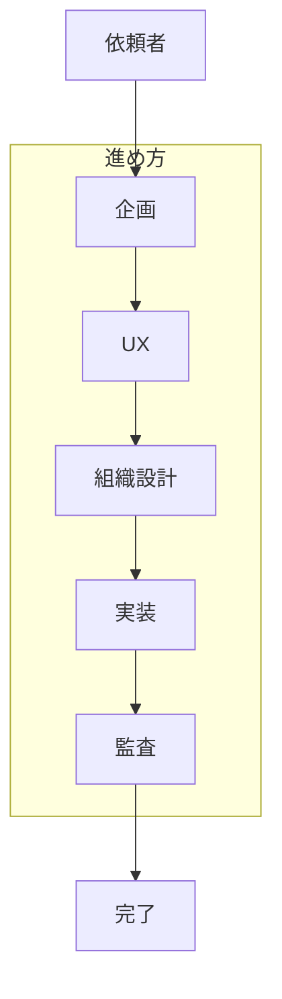

# 〈Epic 名〉 — 依頼者向け企画書

| 版 | 1.0 |
| 日付 | YYYY-MM-DD |
| Epic GID | 〈Asana 親 GID〉 |
| 対象読者 | **依頼者**（技術詳細は別 doc へ） |

---

## 背景

**なぜこの Epic を進めるか。** intake 時の生課題を平易に再構成する。

- きっかけ:
- 困っていること:
- 期待する状態:

## 概要

**何を・いつまでに・誰が**進めるかを 1 段落で。

## 詳細

### 解決の流れ（ストーリー）

1. 〈ステップ 1 — 何を先に決めるか〉
2. 〈ステップ 2〉
3. 〈ステップ 3〉

### 子タスク一覧

| 順 | チーム | やること | 完了の目安 |
|----|--------|----------|------------|
| 1 | 〈department〉 | 〈概要〉 | 〈done_when 要約〉 |
| 2 | … | … | … |

### リスク・前提

| リスク / 前提 | 対応 |
|---------------|------|
| 〈例: スコープ拡大〉 | 〈企画 gate で確認〉 |

### マイルストーン（任意）

| MS | 節目 | 達成イメージ |
|----|------|--------------|
| MS1 | 企画完了 | Handoff 確定 |
| MS2 | … | … |

## まとめ

- **この Epic で得られるもの:**
- **依頼者にお願いしたいこと（あれば）:** 〈例: gate 承認 · 情報提供〉

---

## 付録（任意）

- Handoff パス: `output/planning/handoff/〈file〉.json`
- PlanReview: `passed` / `passed_with_notes` / …
